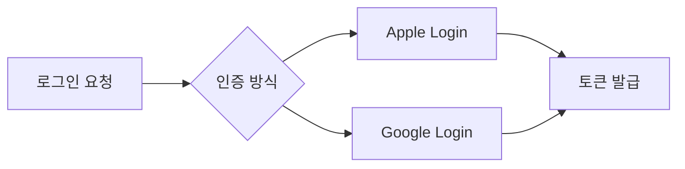

# PR & 코드 리뷰 규칙

## PR 작성 가이드

### 제목
```
[티켓번호] 간결한 설명 (70자 이내)
```
- 티켓번호: Jira, Monday, GitHub Issue 등 업무 툴의 이슈 키
- 예: `[PROJ-123] 소셜 로그인 화면 추가`
- 티켓이 없는 경우: `[NO-TICKET] 오타 수정`

### 본문 템플릿
```markdown
## 개요
- 변경 사항에 대한 1~2줄 요약

## 변경 내용
- 구체적인 변경 사항 목록

## 다이어그램 (복잡한 로직 변경 시)
- Mermaid를 활용하여 플로우/구조를 시각화
- 예: 상태 변화, API 호출 흐름, 모듈 간 의존성 등



## 스크린샷 (UI 변경 시)
| Before | After |
|--------|-------|
|        |       |

## 테스트
- [ ] 단위 테스트 추가/수정
- [ ] UI 테스트 확인
- [ ] 기기별 확인 (iPhone/iPad)

## 참고 사항
- 리뷰어가 알아야 할 컨텍스트
- 관련 이슈/티켓 링크
```

### PR 크기
- **300줄 이하** 권장 (리뷰 파일 기준)
- 초과 시 PR 분리 검토
- 자동 생성 파일(xib, storyboard, 패키지)은 제외

## 코드 리뷰

### 리뷰어 지정
- 최소 1명 필수, 핵심 모듈 변경 시 2명
- 본인이 작업한 PR은 본인이 승인 불가

### 리뷰 응답
- 리뷰 요청 후 **영업일 기준 1일 이내** 1차 리뷰
- 리뷰 반영 후 재요청 시 **반나절 이내** 재확인

### 리뷰 체크리스트
- [ ] 요구사항과 일치하는가
- [ ] 네이밍이 명확한가
- [ ] 불필요한 코드/주석이 없는가
- [ ] 에러 처리가 적절한가
- [ ] 메모리 누수 가능성이 없는가 (retain cycle)
- [ ] 접근 제어자가 적절한가 (불필요한 public/open 없는지)
- [ ] 기존 코드와 일관성을 유지하는가

### 리뷰 코멘트 접두어
| 접두어 | 의미 |
|---|---|
| `[Must]` | 반드시 수정 필요 |
| `[Should]` | 수정 권장 |
| `[Nit]` | 사소한 제안, 선택 사항 |
| `[Question]` | 이해를 위한 질문 |

## 머지 조건

- 모든 `[Must]` 코멘트 해결
- CI 통과
- 최소 1명 Approve
- 충돌 없음
