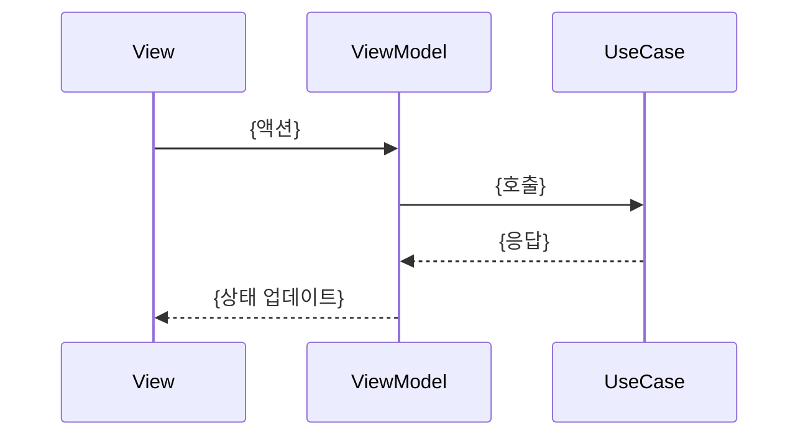

# Handoff — 스펙 문서화

모든 태스크가 완료되면 구현 내용을 `docs/{기능명}.md`에 스펙 문서로 저장한다.

## When to Activate

- workflow.md의 NEXT 단계에서 모든 태스크가 완료되었을 때
- 사용자가 `/handoff`로 직접 호출할 때

## 인자

- `$ARGUMENTS`: 기능명 (필수, kebab-case)
  - 예: `/handoff login-screen`

---

## Phase 1: 구현 내용 수집

아래 소스를 읽어 스펙 문서 작성에 필요한 정보를 수집한다:

1. 구현된 소스 파일 — 주요 타입, Protocol, 의존성 파악
2. `.claude/tracking/{기능명}/decisions.md` — 아키텍처 결정 사항
3. `.claude/tracking/{기능명}/BACKLOG.md` — 구현 범위 확인

---

## Phase 2: 스펙 문서 작성

저장 위치: `docs/{기능명}.md`

### 필수 섹션

```markdown
# {기능명}

## 개요

{기능의 목적과 역할을 2~3줄로 설명}

## 아키텍처

{레이어 구조와 의존성 흐름 설명}
- 레이어: {예: Presentation → Domain → Data}
- 주요 의존성: {예: LoginViewModel → LoginUseCase → AuthRepository}

## 주요 컴포넌트

| 타입 | 이름 | 역할 |
|---|---|---|
| Protocol | `{이름}` | {역할} |
| ViewModel | `{이름}` | {역할} |
| UseCase | `{이름}` | {역할} |
| Repository | `{이름}` | {역할} |

## 데이터 모델

{주요 Entity, DTO, 상태 타입 설명}

```swift
{핵심 모델 코드 스니펫}
```

## 아키텍처 결정

{decisions.md의 내용 요약. 없으면 섹션 제거}
```

### 선택 섹션

해당하는 경우에만 포함한다.

```markdown
## 플로우차트

{사용자 흐름 또는 데이터 흐름이 복잡한 경우}

```mermaid
flowchart TD
    A[{시작}] --> B[{단계}]
    B --> C{조건}
    C -->|Yes| D[{결과}]
    C -->|No| E[{결과}]
```

## 시퀀스 다이어그램

{레이어 간 호출 흐름이 복잡한 경우}



## 알려진 제약 및 한계

{기술 부채, 미구현 엣지 케이스, 개선 필요 사항}
```

---

## Phase 3: 결과 보고

```markdown
## Handoff 완료

- 문서: `docs/{기능명}.md`
- PR: {PR URL}
```
